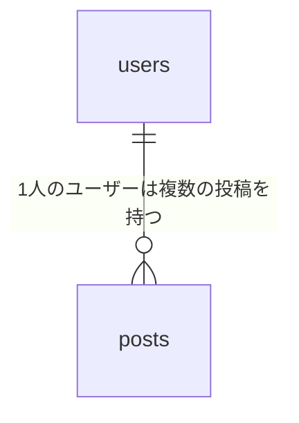

疑問点についてはいったんこちらで推測の上設計することにした

## 1. エンティティを洗い出す
- アカウント(users)
- スペース(spaces)
- カテゴリ(space_categories)
- 設備(equipments)
- 予約(reservation)
- 料金(charges)
- 支払い(payments)
- レビュー(reviews)
- お気に入り(likes)
- 営業時間(business_hours)  
ほぼセクションのタイトルを書き写すだけになってしまった...

## 2. 各テーブルの属性を決める
### 利用者(users)
- id(PK)
- name
- email (unique)
- tel_no
- password_digest (パスワードのハッシュ)
- category (利用者/所有者/管理者)
- created_at
- updated_at
- withdrawn_at
### スペース(spaces)
- id(PK)
- owner_id(FK)
- name
- description
- location
- address
- min_usage_time (最低利用時間)
- max_usage_people (最大利用人数)
- base_fee (基本料金)
- state (公開状態)
- crated_at
- updated_at
- deleted_at
